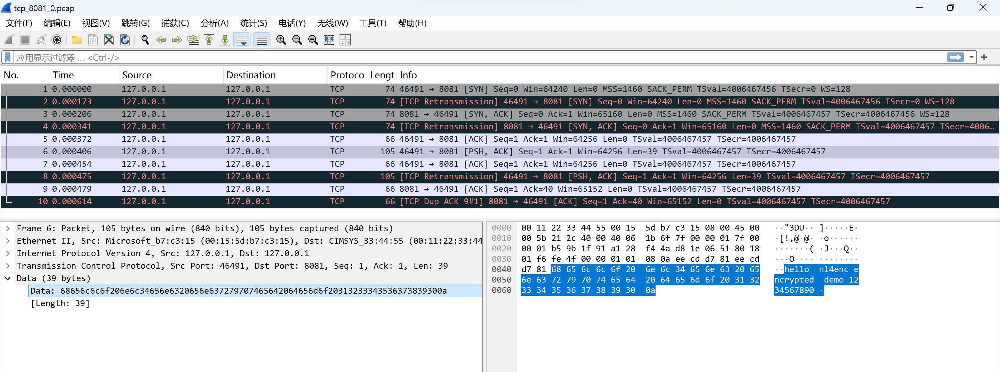
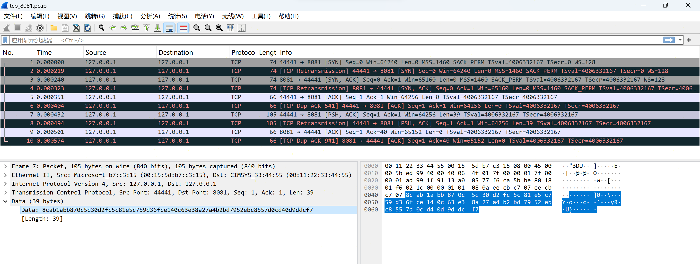

# nl4enc

`nl4enc` is an experimental Linux Netfilter project that transparently
encrypts and decrypts TCP payloads between configured IPv4 peers.

It contains:

- `kmod/`: a Linux kernel module (`nl4_bypass.ko`) that handles the packet data
  path through Netfilter hooks.
- `app/`: a user-space CLI (`nl4enc`) that manages rules, derives keys from
  PSKs, persists configuration, loads/unloads the module, and syncs runtime
  rules through Generic Netlink.

Noticed: This is a systems/kernel networking project instead of a production VPN. 

## Behavior

For matching IPv4 TCP traffic, the module:

1. Finds a configured rule for the remote host and service selector.
2. Encrypts outbound TCP payload bytes in place.
3. Decrypts inbound TCP payload bytes in place.
4. Recomputes IP/TCP checksums after payload mutation.
5. Accepts traffic normally when no rule matches.

The packet size is not changed. IP and TCP headers remain visible; only payload
bytes are transformed. Rules are configured independently on both peers, and
both sides must use compatible rules and the same PSK-derived key.

## Figures

Example Wireshark captures are stored under `asset/`.

<figure>
  
  <figcaption>Figure 1: TCP payload is visible as plaintext when no nl4enc rule is active.</figcaption>
</figure>

<figure>
  
  <figcaption>Figure 2: With nl4enc active, the TCP payload bytes are transformed while headers remain visible.</figcaption>
</figure>

## Layout

```text
.
├── Makefile              # top-level build targets
├── app/                  # user-space CLI
├── include/              # shared Generic Netlink ABI
└── kmod/                 # Netfilter kernel module
```

`include/nl4_netlink.h` defines the shared Generic Netlink ABI. The main kernel
path is in `kmod/nl4_entry.c`, with crypto helpers in `kmod/nl4_utility.c`. The
CLI entry point is `app/nl4enc.c`; config, Generic Netlink, KDF, module loading,
and route-source inference are split across the other `app/nl4_*.c` files.

## Build

Expected dependencies on Debian/Ubuntu-like systems:

- kernel headers/build tree for the running kernel
- C compiler and `make`
- `libnl-3` and `libnl-genl-3` development headers/libraries
- OpenSSL development headers/libraries

Example:

```sh
sudo apt install build-essential linux-headers-$(uname -r) \
  libnl-3-dev libnl-genl-3-dev libssl-dev
```

WSL2 kernels may require matching Microsoft-provided kernel headers or a local
kernel build tree.

```sh
make            # build kernel module and CLI
make build-krn  # build kmod/nl4_bypass.ko
make build-usr  # build app/nl4enc
make clean
```

## Operation

`nl4enc` separates saved configuration from kernel runtime state:

- `nl4enc rule ...` edits `/etc/nl4enc/rules.json`.
- `nl4enc on` loads `nl4_bypass.ko`.
- `nl4enc apply` flushes the module's runtime rules and pushes saved rules over
  Generic Netlink.
- `nl4enc stop` unloads the module.

Rules can be prepared before the module is loaded. Rule changes are not active
in the kernel until `nl4enc apply` runs.

The rules file is `/etc/nl4enc/rules.json`. It stores the derived 32-byte key,
KDF metadata, salt, local source IP, and a short key fingerprint. It does not
store the original PSK.

## Rules

Each rule is keyed by:

- remote IPv4 address
- local source IPv4 address
- service type
- shared 32-byte key(derived from psk)

Supported service selectors:

- `--remote-service <port>`: match traffic for a service running on the remote
  peer.
- `--local-service <port>`: match traffic for a service running on the local
  peer.
- `--all-ports`: match all TCP payloads between the configured hosts.

If `--src-ip` is omitted, the CLI tries to infer it with `ip route get
<remote-ip>`.

Add a rule:

```sh
sudo app/nl4enc rule add <remote-ip> \
  --psk <shared-secret> \
  --remote-service <port> \
  --src-ip <local-ip>
```

Load the module and apply saved rules:

```sh
sudo app/nl4enc on --apply
```

Common commands:

```sh
sudo app/nl4enc rule list
sudo app/nl4enc rule delete <remote-ip> --remote-service <port>
sudo app/nl4enc rule flush
sudo app/nl4enc apply
sudo app/nl4enc stop
```

Use `--replace` when adding a rule that already exists.

## Two-Peer Example

Assume:

- host A: `192.0.2.10`
- host B: `192.0.2.20`
- service on host B: TCP `8081`

On host A:

```sh
sudo app/nl4enc rule add 192.0.2.20 \
  --psk "example shared secret" \
  --remote-service 8081 \
  --src-ip 192.0.2.10
sudo app/nl4enc on --apply
```

On host B:

```sh
sudo app/nl4enc rule add 192.0.2.10 \
  --psk "example shared secret" \
  --local-service 8081 \
  --src-ip 192.0.2.20
sudo app/nl4enc on --apply
```

The client-side rule uses `--remote-service 8081`; the server-side rule uses
`--local-service 8081`.

## Keys And Parameters

The normal interface is `--psk <shared-secret>`. The CLI derives the runtime key
with PBKDF2-HMAC-SHA256 and a deterministic salt based on the two peer IPv4
addresses. For debugging, `--key <64-hex-chars>` can supply a raw 32-byte key.

Optional kernel module parameters:

- `nl4_debug`: enable additional packet logging.
- `nl4_perf`: collect and print simple packet/byte/timing counters when the
  module exits.

Example:

```sh
sudo insmod kmod/nl4_bypass.ko nl4_debug=1
```

The CLI searches for the module at `kmod/nl4_bypass.ko`, `./nl4_bypass.ko`,
`../kmod/nl4_bypass.ko`, or the path set in `NL4_MODULE_PATH`.

## Validation

Known local validation results:

- Tested locally on WSL2 Ubuntu 24.04.
- Tested across WSL2 Ubuntu 24.04 and Raspberry Pi 5 ARMv8.
- Same rule and same PSK on both peers: communication succeeds.
- Same rule and different PSKs: communication fails because the payload cannot
  be recovered.
- One peer configured only: communication fails.
- No rules on either peer: traffic bypasses normally.

## Scope

Implemented:

- IPv4 TCP payload transformation.
- Local input/output Netfilter hooks.
- Static per-peer rules pushed from user space.
- PSK-derived symmetric keys.
- Generic Netlink as the user/kernel control channel.

Not implemented as production features:

- key exchange
- peer discovery
- authentication handshake
- replay protection
- NAT traversal
- IPv6
- production security guarantees

## Acknowledgements

This project is based on and extends the GPL-licensed project [Netfilter-L4-Encryption](https://github.com/iamhyc/Netfilter-L4-Encryption.git) by `iamhyc`.

Major changes in this fork include:
- Adapt the module to Linux kernel 6.8+ 
- change the encryption suit to stream cipher to avoid tcp sequence number issues
- Updated the kernel packet transformation path and solve GSO problem
- Added/extended the `nl4enc` user-space CLI
- Added Generic Netlink-based rule synchronization
- Added PSK-based key derivation and persistent rule configuration
- Validated the module on WSL2 Ubuntu 24.04 and Raspberry Pi 5 ARMv8

This repository preserves the original GPL license and copyright notices.